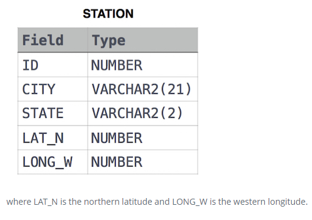

SQL
------------------

|               |               |
|---------------|:--------------|
| Author        | Avinash Sorab |
| Language      | Oracle        |
| Date Created  | 28th Jan 2020 |
| Questions     | HackerRank    |


<!-- TOC -->

- [Basic Queries on City Table](#basic-queries-on-city-table)
    - [Revising the Select Query I](#revising-the-select-query-i)
    - [Revising the Select Query II](#revising-the-select-query-ii)
    - [Select All](#select-all)
    - [Select All](#select-all-1)
    - [Select By ID](#select-by-id)
    - [Japanese Cities' Attributes](#japanese-cities-attributes)
    - [Japanese Cities' Names](#japanese-cities-names)
- [Weather Observation Station](#weather-observation-station)
    - [Weather Observation Station 1](#weather-observation-station-1)
    - [Weather Observation Station 2](#weather-observation-station-2)
    - [Weather Observation Station 3](#weather-observation-station-3)
    - [Weather Observation Station 4](#weather-observation-station-4)
    - [Weather Observation Station 5](#weather-observation-station-5)
    - [Weather Observation Station 6](#weather-observation-station-6)
    - [Weather Observation Station 7](#weather-observation-station-7)
    - [Weather Observation Station 8](#weather-observation-station-8)
    - [Weather Observation Station 9](#weather-observation-station-9)
    - [Weather Observation Station 10](#weather-observation-station-10)
    - [Weather Observation Station 11](#weather-observation-station-11)
    - [Weather Observation Station 11](#weather-observation-station-11-1)
- [Students Table](#students-table)
    - [Higher Than 75 Marks](#higher-than-75-marks)
- [Employee Table](#employee-table)
    - [Employee Names](#employee-names)
    - [Employee Salaries](#employee-salaries)
    - [Occupations](#occupations)
    - [New Companies](#new-companies)
    - [Binary Tree Nodes](#binary-tree-nodes)
    - [PADS](#pads)
    - [Type of Triangle](#type-of-triangle)
- [Aggregation](#aggregation)
    - [Population Density Difference](#population-density-difference)
    - [The Blunder](#the-blunder)
    - [Top Earners](#top-earners)

<!-- /TOC -->


BASIC SELECT
============================================================

# Basic Queries on City Table


## Revising the Select Query I

Query all columns for all American cities in CITY with populations larger than 100000

```
SELECT * FROM City WHERE CountryCode = 'USA' AND Population  > 100000;
```

## Revising the Select Query II

Query all columns for all American cities in CITY with populations larger than 120000

```
SELECT * FROM City WHERE CountryCode = 'USA' AND Population  > 120000;
```

## Select All

Query all columns (attributes) for every row in the CITY table

```
SELECT * FROM City;
```


## Select All

Query all columns for a city in CITY with the ID 1661

```
SELECT * FROM City WHERE ID = 1661;
```

## Select By ID

Query all columns for a city in CITY with the ID 1661

```
SELECT * FROM City WHERE ID = 1661;
```

## Japanese Cities' Attributes

Query all attributes of every Japanese city in the CITY table. The COUNTRYCODE for Japan is JPN

```
SELECT * FROM City WHERE CountryCode = 'JPN';
```

## Japanese Cities' Names

Query the names of all the Japanese cities in the CITY table. The COUNTRYCODE for Japan is JPN

```
SELECT name FROM City WHERE CountryCode = 'JPN';
```

# Weather Observation Station



## Weather Observation Station 1

Query a list of CITY and STATE from the STATION table.

```
SELECT city, state FROM station;
```

## Weather Observation Station 2

Query the following two values from the STATION table:

The sum of all values in LAT_N rounded to a scale of  decimal places.
The sum of all values in LONG_W rounded to a scale of  decimal places.

```
SELECT ROUND(SUM(lat_n), 2), ROUND(SUM(long_w), 2) FROM station;
```

## Weather Observation Station 3

Query a list of CITY names from STATION with even ID numbers only. You may print the results in any order, but must exclude duplicates from your answer.

```
SELECT DISTINCT city FROM station WHERE id LIKE '%2' OR id LIKE '%4' OR id LIKE '%6' OR id LIKE '%8' OR id LIKE '%0';
```

OR

```
SELECT DISTINCT city FROM station WHERE SUBSTR(id, LENGTH(id), 1) IN (2, 4, 6, 8, 0);
```

## Weather Observation Station 4

Let N be the number of CITY entries in STATION, and 
let N' be the number of distinct CITY names in STATION; 
query the value of  N-N' from STATION. In other words, find the difference between the total number of CITY entries in the table and the number of distinct CITY entries in the table.

```
SELECT DISTINCT (SELECT COUNT(city) FROM station) - (SELECT COUNT(DISTINCT city) FROM station) FROM station;
```

(SELECT COUNT(city) FROM station) - Gives total number of cities

(SELECT COUNT(DISTINCT city) FROM station) - Gives total number of distinct cities

Subtract them. However you'll get the difference for as many rows as you have in cities.

So DISTINCT SELECT is needed on the outer query.


## Weather Observation Station 5

Query the two cities in STATION with the shortest and longest CITY names, as well as their respective lengths (i.e.: number of characters in the name). If there is more than one smallest or largest city, choose the one that comes first when ordered alphabetically.

MSSQL
```
SELECT city, LEN(city) as City_Length FROM (
	SELECT TOP 1 city, LEN(city) AS city_length_1
	FROM station
	WHERE LEN(city) = (SELECT MIN(LEN(city)) FROM station)
	ORDER BY city
	) A

UNION

SELECT city, LEN(city)
FROM (
	SELECT TOP 1 city, LEN(city) AS city_length_2
	FROM station
	WHERE LEN(city) = (SELECT MAX(LEN(city)) FROM station)
	ORDER BY city
) B
```

In Oracle rownum=1 is equivalent to TOP 1

Important Things to consider

- Referencing the table as A and B is important.
- Aliasing the column name for length of cities is important since LEN(city) is also present in the outer query

## Weather Observation Station 6

Query the list of CITY names starting with vowels (i.e., a, e, i, o, or u) from STATION. Your result cannot contain duplicates.

MSSQL
```
SELECT DISTINCT city FROM station WHERE SUBSTRING(city, 1, 1) IN ('A','E','I','O','U');
```
OR
```
SELECT DISTINCT city FROM station WHERE LEFT(city, 1) IN ('A','E','I','O','U');
```

LEFT - MSSQL Function to return the first n characters
RIGHT - MSSQL Function to return the last n characters

## Weather Observation Station 7

Query the list of CITY names ending with vowels (a, e, i, o, u) from STATION. Your result cannot contain duplicates.

MSSQL
```
SELECT DISTINCT city FROM station WHERE SUBSTRING(city, LEN(city), 1) IN ('a','e','i','o','u');
```
OR
```
SELECT DISTINCT city FROM station WHERE RIGHT(city, 1) IN ('A','E','I','O','U');
```

## Weather Observation Station 8

Query the list of CITY names from STATION which have vowels (i.e., a, e, i, o, and u) as both their first and last characters. Your result cannot contain duplicates.

MSSQL

```
SELECT DISTINCT city FROM station WHERE RIGHT(city, 1) IN ('a','e','i','o','u')
AND LEFT(city, 1) IN ('a','e','i','o','u');
```

## Weather Observation Station 9

Query the list of CITY names from STATION that do not start with vowels. Your result cannot contain duplicates.

MSSQL

```
SELECT DISTINCT city FROM station WHERE LEFT(city, 1) NOT IN ('a','e','i','o','u');
```


## Weather Observation Station 10

Query the list of CITY names from STATION that do not end with vowels. Your result cannot contain duplicates.

MSSQL

```
SELECT DISTINCT city FROM station WHERE RIGHT(city, 1) NOT IN ('a','e','i','o','u');
```

## Weather Observation Station 11

Query the list of CITY names from STATION that either do not start with vowels or do not end with vowels. Your result cannot contain duplicates.

MSSQL

```
SELECT DISTINCT city FROM station WHERE LEFT(city, 1) NOT IN ('a','e','i','o','u') OR RIGHT(city, 1) NOT IN ('a','e','i','o','u');
```


## Weather Observation Station 11

Query the list of CITY names from STATION that do not start with vowels and do not end with vowels. Your result cannot contain duplicates.

MSSQL

```
SELECT DISTINCT city FROM station WHERE LEFT(city, 1) NOT IN ('a','e','i','o','u') AND RIGHT(city, 1) NOT IN ('a','e','i','o','u');
```


# Students Table


## Higher Than 75 Marks


Query the Name of any student in STUDENTS who scored higher than  Marks. Order your output by the last three characters of each name. If two or more students both have names ending in the same last three characters (i.e.: Bobby, Robby, etc.), secondary sort them by ascending ID.

MSSQL
```
SELECT name FROM students WHERE marks>75 ORDER BY SUBSTRING(name,LEN(name)-2) ASC, id ASC;
```

# Employee Table


## Employee Names

Write a query that prints a list of employee names (i.e.: the name attribute) from the Employee table in alphabetical order.

MySQL
```
SELECT name FROM Employee 
ORDER BY name ASC;
```


## Employee Salaries

Write a query that prints a list of employee names (i.e.: the name attribute) for employees in Employee having a salary greater than $2000 per month who have been employees for less than 10 months. Sort your result by ascending employee_id.


MySQL
```
SELECT name FROM Employee 
WHERE salary > 2000
AND months < 10
ORDER BY employee_id;
```


ADVANCED SELECT
============================================================

## Occupations


Pivot the Occupation column in OCCUPATIONS so that each Name is sorted alphabetically and displayed underneath its corresponding Occupation. The output column headers should be Doctor, Professor, Singer, and Actor, respectively.

Note: Print NULL when there are no more names corresponding to an occupation.

Occupation will only contain one of the following values: Doctor, Professor, Singer or Actor.

MySQL
```
SET @r1=0, @r2=0, @r3=0, @r4=0;
SELECT MIN(Doctor), MIN(Professor), MIN(Singer), MIN(Actor)
FROM (
  SELECT CASE 
            WHEN Occupation='Doctor' THEN (@r1:=@r1+1)
            WHEN Occupation='Professor' THEN (@r2:=@r2+1)
            WHEN Occupation='Singer' THEN (@r3:=@r3+1)
            WHEN Occupation='Actor' THEN (@r4:=@r4+1) END AS RowNumber,
    CASE WHEN Occupation='Doctor' THEN Name END AS Doctor,
    CASE WHEN Occupation='Professor' THEN Name END AS Professor,
    CASE WHEN Occupation='Singer' THEN Name END AS Singer,
    CASE WHEN Occupation='Actor' THEN Name END AS Actor
  from OCCUPATIONS
  ORDER BY Name
) Temp
GROUP BY RowNumber
```


## New Companies

Amber's conglomerate corporation just acquired some new companies. Each of the companies follows this hierarchy:


Given the table schemas below, write a query to print the company_code, founder name, total number of lead managers, total number of senior managers, total number of managers, and total number of employees. Order your output by ascending company_code.


Note:

The tables may contain duplicate records.
The company_code is string, so the sorting should not be numeric. For example, if the company_codes are C_1, C_2, and C_10, then the ascending company_codes will be C_1, C_10, and C_2.


```
SELECT C.company_code, C.founder, COUNT(DISTINCT L.lead_manager_code), COUNT(DISTINCT S.senior_manager_code), COUNT(DISTINCT M.manager_code), COUNT(DISTINCT E.employee_code) FROM Company C, Lead_Manager L, Senior_Manager S, Manager M, Employee E 
WHERE C.company_code = L.company_code 
AND L.lead_manager_code = S.lead_manager_code
AND S.senior_manager_code = M.senior_manager_code
AND M.manager_code = E.manager_code
GROUP BY C.company_code, C.founder
ORDER BY C.company_code
```

Selecting from multiple tables

## Binary Tree Nodes


You are given a table, BST, containing two columns: N and P, where N represents the value of a node in Binary Tree, and P is the parent of N.

```
 SELECT N, 
 IF (P IS NULL, 'Root', 
	IF( 
		(SELECT COUNT(*) FROM BST WHERE P=B.N) > 0, 'Inner', 'Leaf')
	) 
    FROM BST AS B ORDER BY N;
```

SQL - IF

IF(condition, result, result_for_else)

(SELECT COUNT(*) FROM BST WHERE P=B.N) 

Co-related subquery, subquery runs for all the N present in the outer query
Query searches the number of elements whose parents are the Ns present in the outer query.

## PADS


Generate the following two result sets:

Query an alphabetically ordered list of all names in OCCUPATIONS, immediately followed by the first letter of each profession as a parenthetical 
(i.e.: enclosed in parentheses). 

For example:

AnActorName(A),

ADoctorName(D), 

AProfessorName(P), and 

ASingerName(S).

Query the number of ocurrences of each occupation in OCCUPATIONS. Sort the occurrences in ascending order, and output them in the following format:

There are a total of **occupation_count** **occupations**.
where **occupation_count** is the number of occurrences of an occupation in OCCUPATIONS and **occupation** is the lowercase occupation name. If more than one Occupation has the same **occupation_count**, they should be ordered alphabetically.

Note: There will be at least two entries in the table for each type of occupation.

```
SELECT CONCAT(Name,'(', SUBSTRING(Occupation, 1, 1), ')') FROM Occupations;
SELECT CONCAT('There are a total of ', COUNT(Occupation), ' ', LOWER(Occupation), 's.') FROM Occupations GROUP BY Occupation
ORDER BY COUNT(Occupation), occupation;
```

Use multiple SQL statements to output a set of lines after a set of lines


## Type of Triangle


Write a query identifying the type of each record in the TRIANGLES table using its three side lengths. Output one of the following statements for each record in the table:

**Equilateral**: It's a triangle with 3 sides of equal length.

**Isosceles**: It's a triangle with 2 sides of equal length.

**Scalene**: It's a triangle with 3 sides of differing lengths.

**Not A Triangle**: The given values of A, B, and C don't form a triangle.


```
SELECT
CASE 
WHEN A+B<=C OR B+C<=A OR C+A<=B THEN 'Not A Triangle'
WHEN A=B AND B=C and A=C THEN 'Equilateral'
WHEN A=B OR B=C OR C=A THEN 'Isosceles'
WHEN A<>B AND B<>C AND C<>A THEN 'Scalene'
END OUTPUT
FROM triangles
```

# Aggregation

## Population Density Difference

Query the difference between the maximum and minimum populations in CITY.

```
SELECT MAX(POPULATION) - MIN(POPULATION) FROM CITY;
```


## The Blunder


Write a query calculating the amount of error (i.e.: **actual-miscalculated** average monthly salaries), and round it up to the next integer.

Samantha was tasked with calculating the average monthly salaries for all employees in the EMPLOYEES table, but did not realize her keyboard's  key was broken until after completing the calculation. She wants your help finding the difference between her miscalculation (using salaries with any zeroes removed), and the actual average salary.

Write a query calculating the amount of error (i.e.:  average monthly salaries), and round it up to the next integer.

```
SELECT ROUND(AVG(SALARY) - AVG(REPLACE(SALARY, 0, '')),0)+1 FROM EMPLOYEES;
```

If you're only selecting aggregation in the select clause there's no need of group b.

## Top Earners

